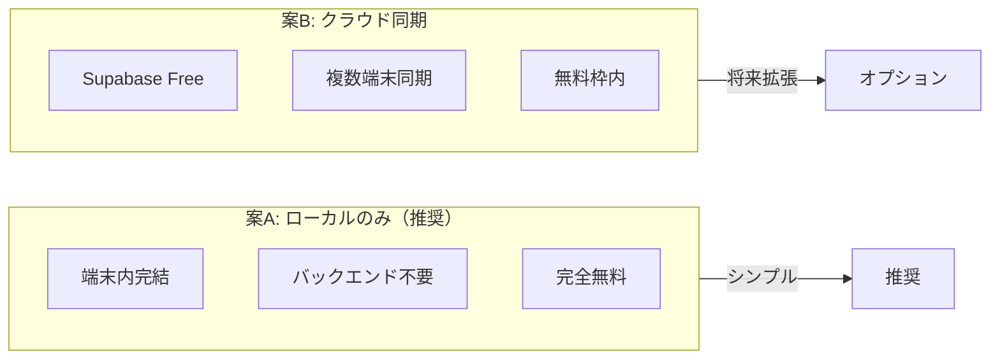
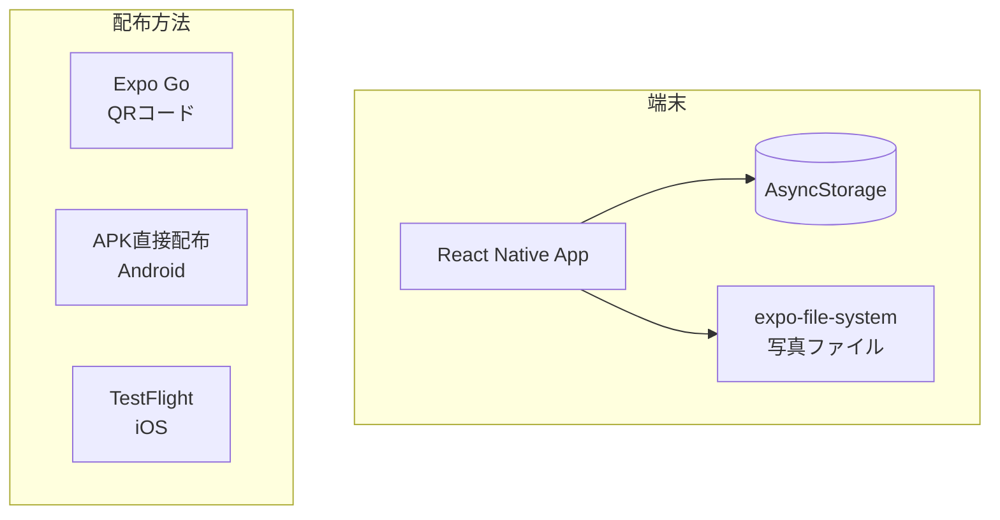
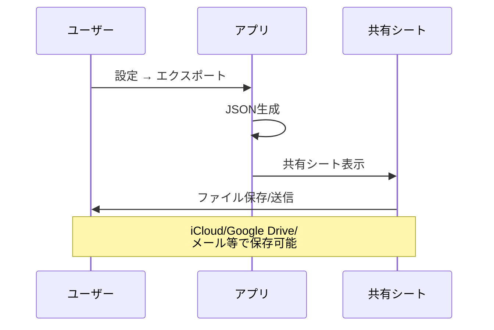
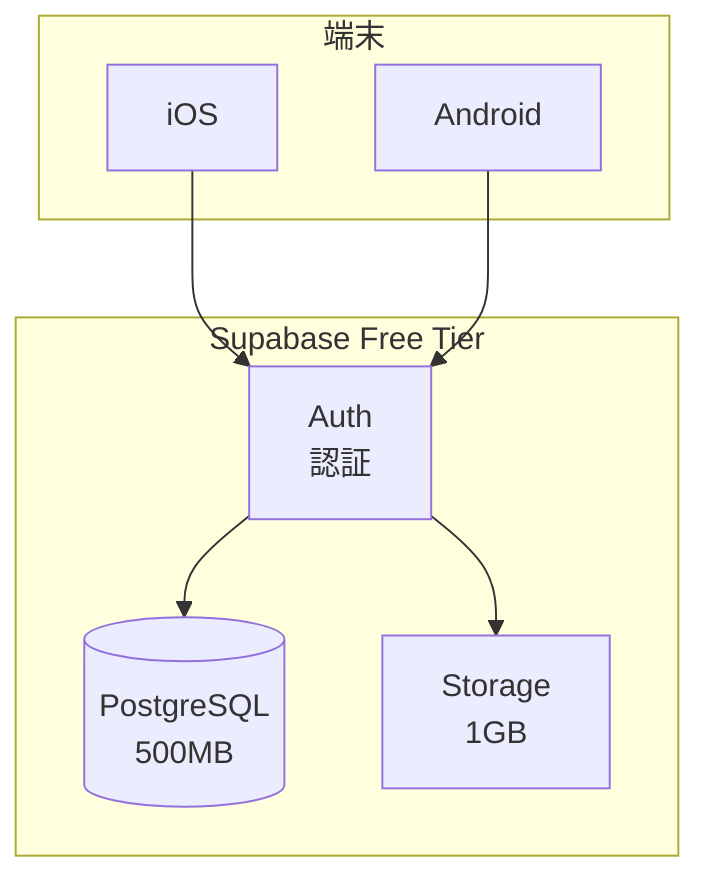
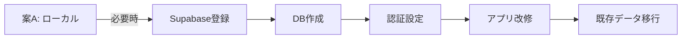
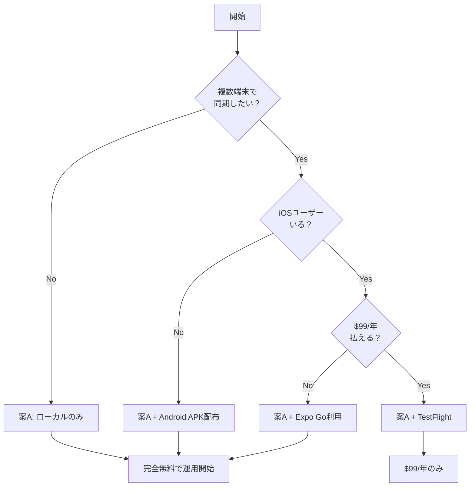

# 猫日記アプリ システム設計書（少人数・無料運用版）

## 1. 概要

**想定規模**: 数人（家族・友人間での利用）  
**コスト目標**: 完全無料（$0/月）

---

## 2. 構成パターン比較



| 項目 | 案A: ローカルのみ | 案B: Supabase Free |
|------|-------------------|---------------------|
| 月額コスト | **$0** | **$0** |
| 複数端末同期 | ✗ | ✓ |
| データバックアップ | 手動エクスポート | 自動クラウド保存 |
| オフライン動作 | ✓ 完全対応 | ✓ 対応 |
| セットアップ難易度 | なし | 低（30分程度） |
| 推奨ユーザー | 1端末利用者 | 複数端末/家族共有 |

---

## 3. 案A: ローカルのみ（現在の実装・推奨）

### 3.1 アーキテクチャ



### 3.2 データ保存

| データ | 保存先 | 容量目安 |
|--------|--------|----------|
| 猫情報 | AsyncStorage | 数KB |
| 日記 | AsyncStorage | 〜1MB（1000件） |
| 健康記録 | AsyncStorage | 〜100KB |
| 写真 | expo-file-system | 端末ストレージ依存 |

### 3.3 バックアップ方法



**実装済み機能**:
- `src/utils/export.ts` — JSON形式でエクスポート/インポート
- 設定画面 → 統計 → エクスポート/インポート

### 3.4 配布方法（すべて無料）

#### Expo Go（開発・テスト用）
```bash
npm start
# → QRコードをExpo Goアプリでスキャン
```
- **メリット**: 即座に実行可能、ビルド不要
- **デメリット**: Expo Goアプリのインストールが必要

#### Android APK（本番配布）
```bash
# ローカルビルド（無料）
npx expo run:android --variant release

# または EAS Build（月30ビルドまで無料）
eas build --platform android --profile preview
```
- APKファイルを直接共有（Google Drive、メール等）
- Google Playストアは不要

#### iOS TestFlight
```bash
eas build --platform ios --profile preview
```
- Apple Developer Program ($99/年) が必要
- **無料代替**: Expo Goでの利用を継続

### 3.5 コスト内訳

| 項目 | コスト |
|------|--------|
| 開発・テスト | $0（Expo Go） |
| Android配布 | $0（APK直接） |
| iOS配布 | $0（Expo Go）または $99/年（TestFlight） |
| バックエンド | $0（なし） |
| **合計** | **$0** |

---

## 4. 案B: Supabase Free（将来オプション）

複数端末同期や自動バックアップが必要になった場合の構成。

### 4.1 アーキテクチャ



### 4.2 無料枠

| リソース | 無料枠 | 数人での消費目安 |
|----------|--------|------------------|
| Database | 500MB | 〜1%使用（5MB） |
| Storage | 1GB | 〜10%使用（100MB） |
| Auth | 50,000 MAU | 〜0.01%使用 |
| API | 500K/月 | 〜1%使用 |

**結論**: 数人なら無料枠の1%も使わない

### 4.3 移行手順（将来必要時）



1. Supabaseアカウント作成（無料）
2. プロジェクト作成
3. `@supabase/supabase-js` 追加
4. 認証UI追加
5. ストレージAPIをSupabaseに切り替え
6. 既存AsyncStorageデータをインポート

**改修工数**: 約2-3日

---

## 5. 推奨プラン



### 今すぐやること

1. **現状のまま使用開始**（案A）
   - バックエンド構築は不要
   - `npm start` → Expo GoでQRスキャン

2. **Android配布が必要な場合**
   ```bash
   npx expo run:android --variant release
   # 生成されたAPKをGoogle Drive等で共有
   ```

3. **データバックアップ**
   - 設定 → 統計 → エクスポート
   - JSONファイルをiCloud/Google Driveに保存

---

## 6. FAQ

### Q: 端末を変えたらデータは消える？
**A**: はい。エクスポート機能で事前にバックアップし、新端末でインポートしてください。

### Q: 家族で猫の記録を共有したい
**A**: 案Bへの移行を検討。または、エクスポートしたJSONファイルを定期的に共有する運用でも可。

### Q: iPhoneで使いたいが$99払いたくない
**A**: Expo Goアプリ経由で利用可能。App Storeには出せないが、機能は同じ。

### Q: 将来ユーザーが増えたら？
**A**: 案Bに移行。Supabase無料枠は50,000MAUまで対応。それ以上なら$25/月〜。

---

## 付録: 現在の実装状態

| 機能 | 状態 | 備考 |
|------|------|------|
| 猫管理 | ✅ 実装済 | CRUD完備 |
| 日記投稿 | ✅ 実装済 | 写真・気分・カテゴリ |
| 健康記録 | ✅ 実装済 | 体重・通院・ワクチン |
| カレンダー | ✅ 実装済 | 月間表示 |
| 統計 | ✅ 実装済 | 気分分布・連続記録 |
| エクスポート | ✅ 実装済 | JSON形式 |
| インポート | ✅ 実装済 | JSON形式 |
| ダークモード | ✅ 実装済 | システム連動 |
| リマインダー | ✅ 実装済 | 通知 |
| **認証** | ❌ 未実装 | 案Aでは不要 |
| **クラウド同期** | ❌ 未実装 | 案Aでは不要 |

**結論**: 案A（ローカルのみ）で必要な機能はすべて実装済み。すぐに利用開始可能。
