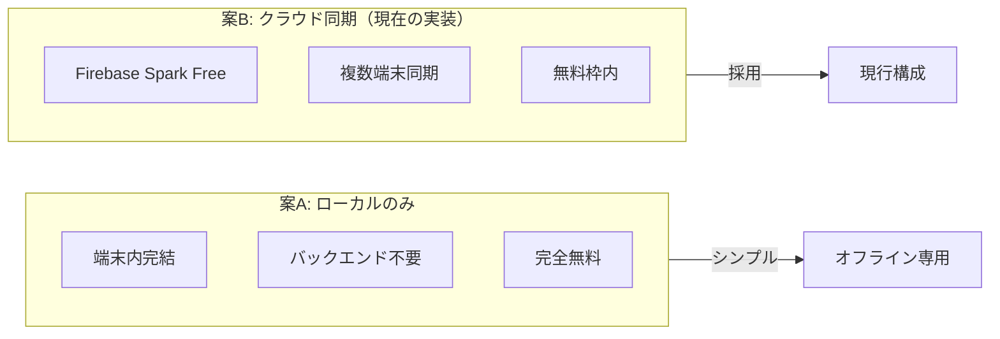
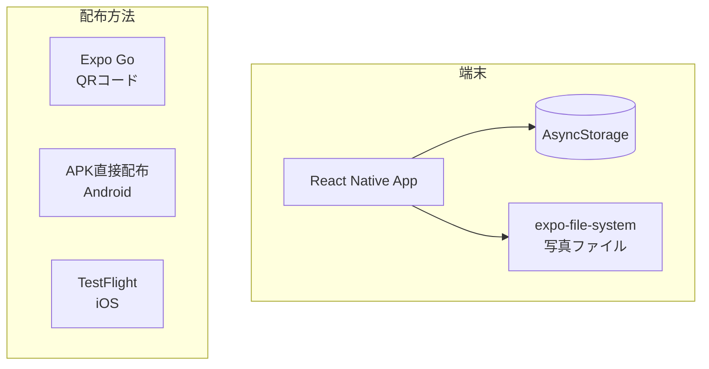
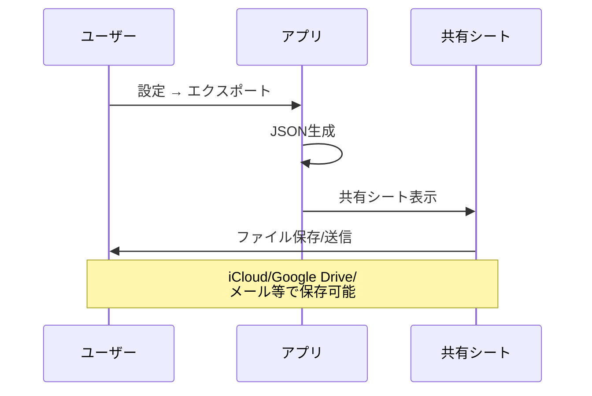
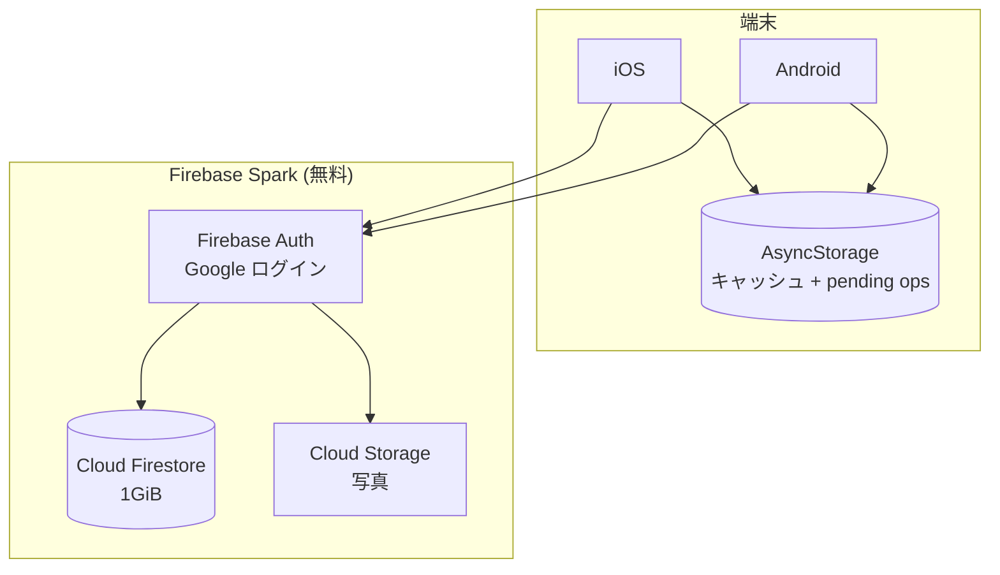
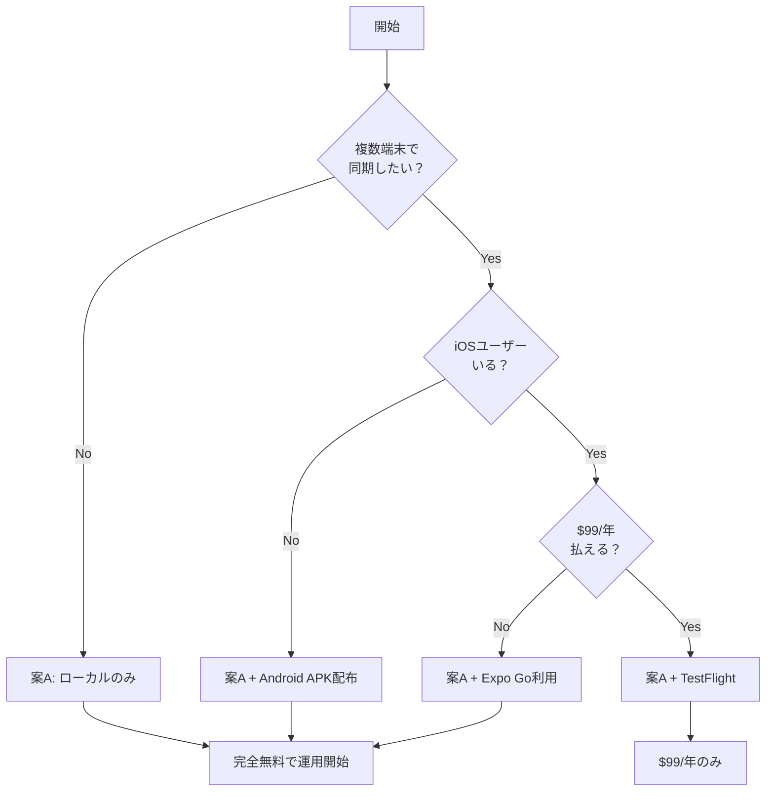
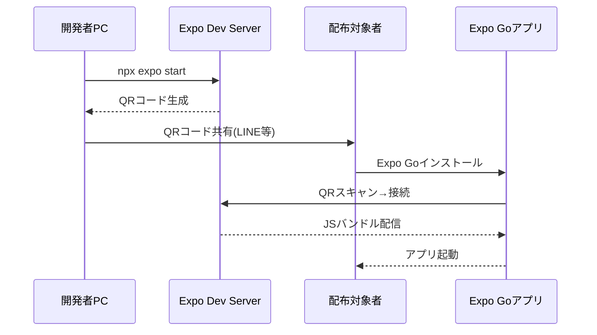
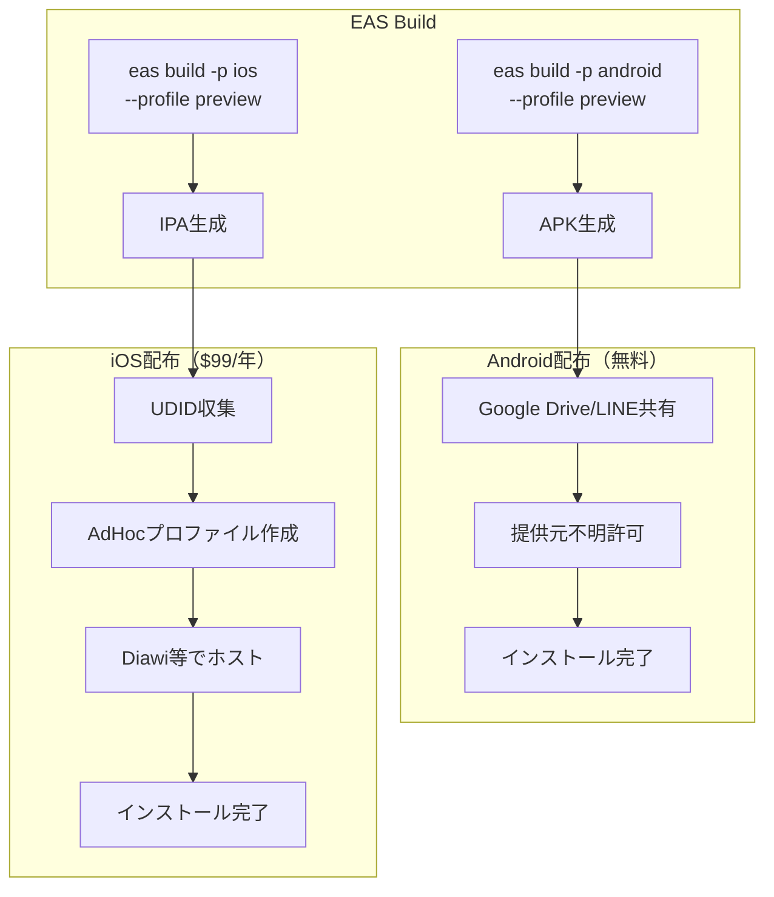
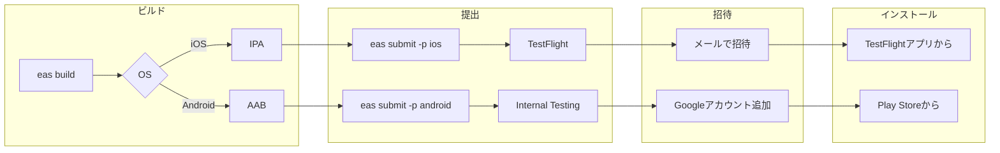
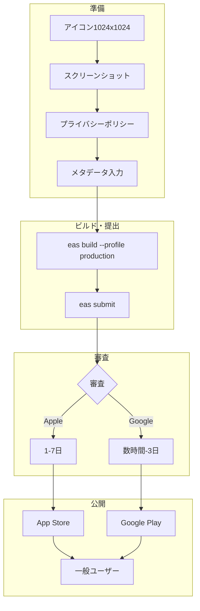
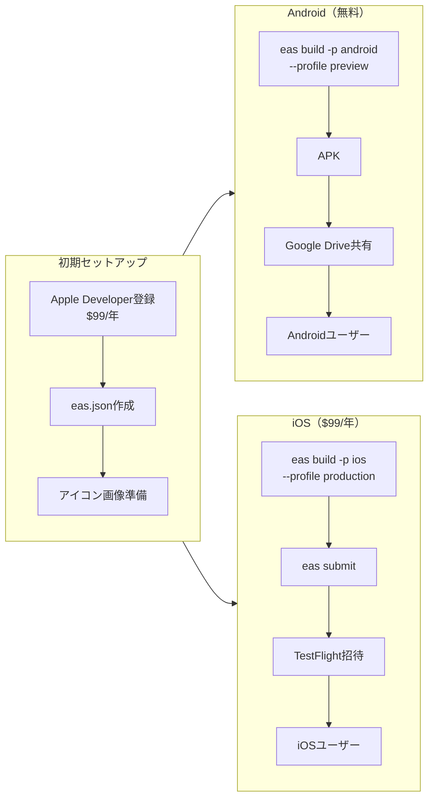

# 猫日記アプリ システム設計書（少人数・無料運用版）

## 1. 概要

**想定規模**: 数人（家族・友人間での利用）  
**コスト目標**: 完全無料（$0/月）

---

## 2. 構成パターン比較



| 項目 | 案A: ローカルのみ | 案B: Firebase Spark（現行） |
|------|-------------------|---------------------|
| 月額コスト | **$0** | **$0** |
| 複数端末同期 | ✗ | ✓ |
| データバックアップ | 手動エクスポート | 自動クラウド保存 |
| オフライン動作 | ✓ 完全対応 | ✓ 対応（キャッシュ + pending ops） |
| セットアップ難易度 | なし | 低（30分程度） |
| 推奨ユーザー | 1端末利用者 | 複数端末/家族共有 |

---

## 3. 案A: ローカルのみ（オフラインフォールバック）

### 3.1 アーキテクチャ



### 3.2 データ保存

| データ | 保存先 | 容量目安 |
|--------|--------|----------|
| 猫情報 | AsyncStorage | 数KB |
| 日記 | AsyncStorage | 〜1MB（1000件） |
| 健康記録 | AsyncStorage | 〜100KB |
| 写真 | expo-file-system | 端末ストレージ依存 |

### 3.3 バックアップ方法



**実装済み機能**:
- `src/utils/export.ts` — JSON形式でエクスポート/インポート
- 設定画面 → 統計 → エクスポート/インポート

### 3.4 配布方法（すべて無料）

#### Expo Go（開発・テスト用）
```bash
npm start
# → QRコードをExpo Goアプリでスキャン
```
- **メリット**: 即座に実行可能、ビルド不要
- **デメリット**: Expo Goアプリのインストールが必要

#### Android APK（本番配布）
```bash
# ローカルビルド（無料）
npx expo run:android --variant release

# または EAS Build（月30ビルドまで無料）
eas build --platform android --profile preview
```
- APKファイルを直接共有（Google Drive、メール等）
- Google Playストアは不要

#### iOS TestFlight
```bash
eas build --platform ios --profile preview
```
- Apple Developer Program ($99/年) が必要
- **無料代替**: Expo Goでの利用を継続

### 3.5 コスト内訳

| 項目 | コスト |
|------|--------|
| 開発・テスト | $0（Expo Go） |
| Android配布 | $0（APK直接） |
| iOS配布 | $0（Expo Go）または $99/年（TestFlight） |
| バックエンド | $0（なし） |
| **合計** | **$0** |

---

## 4. 案B: Firebase Spark Free（現在の実装）

Google ログイン + Firestore + Cloud Storage による複数端末同期構成。

### 4.1 アーキテクチャ



- オンライン時: Firestore に読み書きし、結果を AsyncStorage にキャッシュ
- オフライン時: キャッシュから読み、変更は pending ops キューへ
- オンライン復帰時: `SyncStatusBanner` が pending ops を自動同期

### 4.2 無料枠（Spark プラン）

| リソース | 無料枠 | 数人での消費目安 |
|----------|--------|------------------|
| Firestore 保存 | 1GiB | 〜1%使用 |
| Firestore 読取 | 50,000/日 | 〜1%使用 |
| Firestore 書込 | 20,000/日 | 〜1%使用 |
| Cloud Storage | 5GB | 〜2%使用 |
| Auth | 無制限（Google） | — |

**結論**: 数人なら無料枠の数%も使わない

### 4.3 セットアップ手順

1. [Firebase Console](https://console.firebase.google.com/) でプロジェクト作成（無料）
2. Authentication → Google プロバイダを有効化
3. Firestore Database を作成し `firebase/firestore.rules` を適用
4. Storage を有効化し `firebase/storage.rules` を適用
5. Web アプリを追加し、構成値を `.env`（`.env.example` 参照）に設定
6. Google Cloud Console の OAuth クライアント ID を `.env` に設定
7. `npm start` → ログイン → 既存ローカルデータは初回ログイン時に自動移行

---

## 5. 推奨プラン



### 今すぐやること

1. **現状のまま使用開始**（案A）
   - バックエンド構築は不要
   - `npm start` → Expo GoでQRスキャン

2. **Android配布が必要な場合**
   ```bash
   npx expo run:android --variant release
   # 生成されたAPKをGoogle Drive等で共有
   ```

3. **データバックアップ**
   - 設定 → 統計 → エクスポート
   - JSONファイルをiCloud/Google Driveに保存

---

## 6. 展開方法（iOS/Android対応）

4つの展開方法を比較し、それぞれのアーキテクチャを示します。

### 6.1 コスト比較表

| 方式 | Android | iOS | 合計（初年度） | 適合度 |
|------|---------|-----|----------------|--------|
| Expo Go | $0 | $0 | $0 | △（通知制限） |
| APK/AdHoc | $0 | $99/年 | $99 | ○ |
| TestFlight + Internal | $25（一回） | $99/年 | $124 | ○ |
| ストア公開 | $25（一回） | $99/年 | $124 | △（過剰） |
| **推奨構成** | **$0** | **$99/年** | **$99** | **◎** |

---

### 6.2 方式1: Expo Go（開発・テスト用）



| 項目 | 内容 |
|------|------|
| コスト | **$0** |
| 対応OS | iOS / Android |
| 制限 | expo-notifications制限、開発者PC起動必須 |
| 適合度 | △（本アプリは通知使用のため非推奨） |

---

### 6.3 方式2: APK/AdHoc直接配布



| 項目 | Android | iOS |
|------|---------|-----|
| コスト | **$0** | **$99/年** |
| 手順 | APK共有→即インストール | UDID収集→プロファイル作成→共有 |
| 制限 | 「提供元不明」許可必要 | 最大100台、UDID管理必要 |

---

### 6.4 方式3: TestFlight + Internal Testing



| 項目 | iOS | Android |
|------|-----|---------|
| コスト | **$99/年** | **$25（一回）** |
| プラットフォーム | TestFlight | Google Play Internal Testing |
| メリット | UDID不要、OTAアップデート | 正規ルート配布 |

---

### 6.5 方式4: ストア公開



| 項目 | 費用 |
|------|------|
| Apple Developer | $99/年 |
| Google Play | $25（一回） |
| 初年度合計 | 約$124（約18,750円） |
| 適合度 | △（数人向けには過剰） |

---

### 6.6 推奨構成: Android APK + iOS TestFlight



**年間コスト: $99（約15,000円）** — iOSを含む配布の最小コスト

---

## 7. FAQ

### Q: 端末を変えたらデータは消える？
**A**: いいえ。同じ Google アカウントでログインすれば Firestore から復元されます。

### Q: 家族で猫の記録を共有したい
**A**: 現状は 1 アカウント = 1 ユーザーのデータ。同じ Google アカウントを共用するか、将来的に共有機能（家族グループ）を追加予定。

### Q: iPhoneで使いたいが$99払いたくない
**A**: Expo Goアプリ経由で利用可能。App Storeには出せないが、機能は同じ。

### Q: 将来ユーザーが増えたら？
**A**: Firebase Spark 無料枠で数百人規模まで対応可能。超えたら Blaze（従量課金）へ移行。

---

## 付録: 現在の実装状態

| 機能 | 状態 | 備考 |
|------|------|------|
| 猫管理 | ✅ 実装済 | CRUD完備 |
| 日記投稿 | ✅ 実装済 | 写真・気分・カテゴリ |
| 健康記録 | ✅ 実装済 | 体重・通院・ワクチン |
| カレンダー | ✅ 実装済 | 月間表示 |
| 統計 | ✅ 実装済 | 気分分布・連続記録 |
| エクスポート | ✅ 実装済 | JSON形式 |
| インポート | ✅ 実装済 | JSON形式 |
| ダークモード | ✅ 実装済 | システム連動 |
| リマインダー | ✅ 実装済 | 日記リマインダー + 予定通知 |
| **認証** | ✅ 実装済 | Firebase Auth（Google ログイン） |
| **クラウド同期** | ✅ 実装済 | Firestore + オフラインキャッシュ + 自動同期 |
| **写真クラウド保存** | ✅ 実装済 | Firebase Storage（アップロード前に自動リサイズ） |

**結論**: 案B（Firebase 同期）が実装済み。Firebase プロジェクトを設定すればすぐに利用開始可能。
