# 猫日記アプリ システムアーキテクチャ設計書

## 1. 概要

猫の日記・健康記録・写真を管理するモバイルアプリのバックエンド構成とサービス展開計画。

### 1.1 技術スタック

| レイヤー | 技術 | 備考 |
|----------|------|------|
| フロントエンド | React Native (Expo) | iOS/Android対応 |
| バックエンド | Supabase (BaaS) | PostgreSQL + Auth + Storage |
| CDN | Cloudflare | 画像キャッシュ・DNS |
| Push通知 | Expo Push Notifications | 無料 |
| ビルド | EAS Build | 無料枠あり |

---

## 2. システム構成図

### 2.1 全体アーキテクチャ

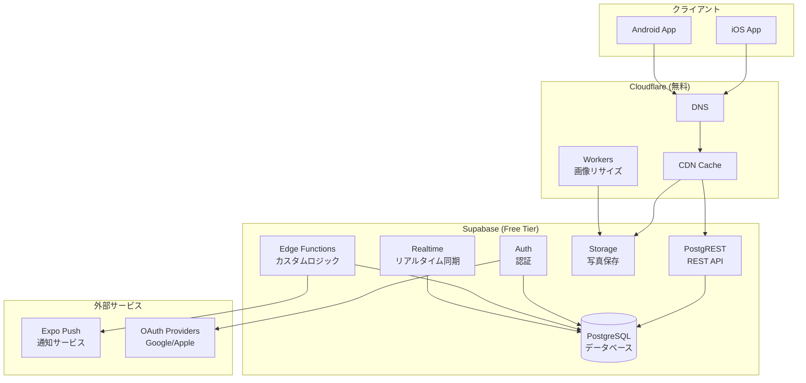

### 2.2 認証フロー

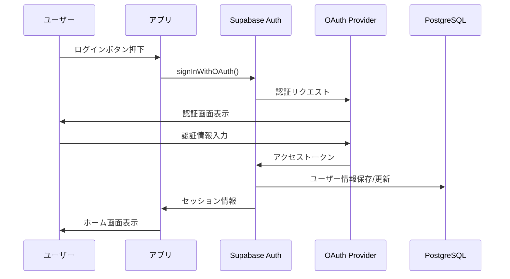

### 2.3 データ同期フロー

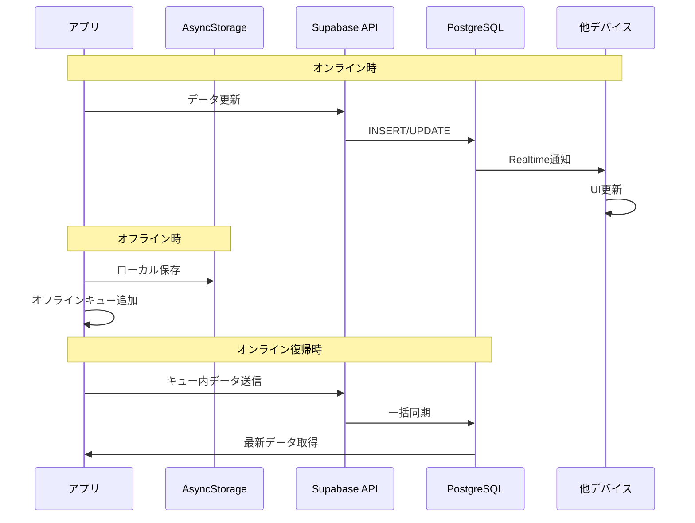

---

## 3. データベース設計

### 3.1 ER図

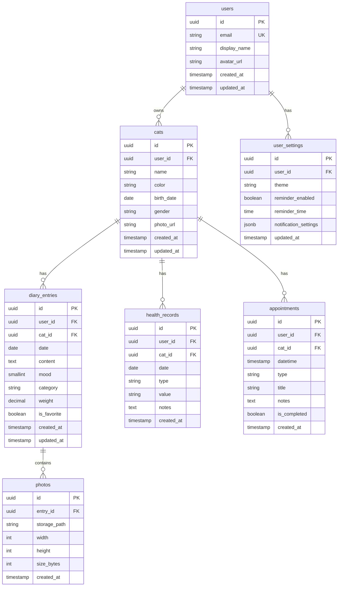

### 3.2 テーブル定義詳細

```sql
-- ユーザー拡張情報（auth.usersを拡張）
create table public.profiles (
    id uuid references auth.users on delete cascade primary key,
    display_name text,
    avatar_url text,
    created_at timestamptz default now(),
    updated_at timestamptz default now()
);

-- 猫
create table public.cats (
    id uuid primary key default gen_random_uuid(),
    user_id uuid references auth.users on delete cascade not null,
    name text not null,
    color text not null default 'brown',
    birth_date date,
    gender text check (gender in ('male', 'female', null)),
    photo_url text,
    created_at timestamptz default now(),
    updated_at timestamptz default now()
);

-- 日記エントリ
create table public.diary_entries (
    id uuid primary key default gen_random_uuid(),
    user_id uuid references auth.users on delete cascade not null,
    cat_id uuid references public.cats on delete cascade not null,
    date date not null default current_date,
    content text,
    mood smallint check (mood between 1 and 5),
    category text,
    weight decimal(4,2),
    is_favorite boolean default false,
    created_at timestamptz default now(),
    updated_at timestamptz default now()
);

-- 写真
create table public.photos (
    id uuid primary key default gen_random_uuid(),
    entry_id uuid references public.diary_entries on delete cascade not null,
    storage_path text not null,
    width int,
    height int,
    size_bytes int,
    created_at timestamptz default now()
);

-- 健康記録
create table public.health_records (
    id uuid primary key default gen_random_uuid(),
    user_id uuid references auth.users on delete cascade not null,
    cat_id uuid references public.cats on delete cascade not null,
    date date not null default current_date,
    type text not null check (type in ('weight', 'vaccine', 'vet', 'medication', 'other')),
    value text,
    notes text,
    created_at timestamptz default now()
);

-- 予定
create table public.appointments (
    id uuid primary key default gen_random_uuid(),
    user_id uuid references auth.users on delete cascade not null,
    cat_id uuid references public.cats on delete cascade not null,
    datetime timestamptz not null,
    type text not null check (type in ('vet', 'vaccine', 'grooming', 'medication', 'other')),
    title text not null,
    notes text,
    is_completed boolean default false,
    created_at timestamptz default now()
);

-- ユーザー設定
create table public.user_settings (
    id uuid primary key default gen_random_uuid(),
    user_id uuid references auth.users on delete cascade unique not null,
    theme text default 'system' check (theme in ('light', 'dark', 'system')),
    reminder_enabled boolean default false,
    reminder_time time default '20:00',
    notification_settings jsonb default '{}',
    updated_at timestamptz default now()
);

-- インデックス
create index idx_cats_user_id on public.cats(user_id);
create index idx_diary_entries_user_id on public.diary_entries(user_id);
create index idx_diary_entries_cat_id on public.diary_entries(cat_id);
create index idx_diary_entries_date on public.diary_entries(date desc);
create index idx_health_records_cat_id on public.health_records(cat_id);
create index idx_appointments_datetime on public.appointments(datetime);
```

### 3.3 Row Level Security (RLS)

```sql
-- 全テーブルでRLS有効化
alter table public.profiles enable row level security;
alter table public.cats enable row level security;
alter table public.diary_entries enable row level security;
alter table public.photos enable row level security;
alter table public.health_records enable row level security;
alter table public.appointments enable row level security;
alter table public.user_settings enable row level security;

-- ポリシー: 自分のデータのみアクセス可能
create policy "Users can view own profile"
    on public.profiles for select using (auth.uid() = id);

create policy "Users can update own profile"
    on public.profiles for update using (auth.uid() = id);

create policy "Users can CRUD own cats"
    on public.cats for all using (auth.uid() = user_id);

create policy "Users can CRUD own diary entries"
    on public.diary_entries for all using (auth.uid() = user_id);

create policy "Users can CRUD own photos"
    on public.photos for all using (
        exists (
            select 1 from public.diary_entries
            where id = photos.entry_id and user_id = auth.uid()
        )
    );

create policy "Users can CRUD own health records"
    on public.health_records for all using (auth.uid() = user_id);

create policy "Users can CRUD own appointments"
    on public.appointments for all using (auth.uid() = user_id);

create policy "Users can CRUD own settings"
    on public.user_settings for all using (auth.uid() = user_id);
```

---

## 4. API設計

### 4.1 エンドポイント一覧

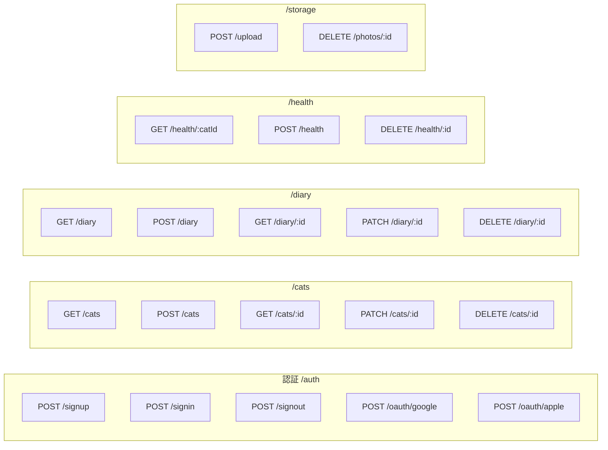

### 4.2 Supabase クライアント設定

```typescript
// src/lib/supabase.ts
import 'react-native-url-polyfill/auto';
import AsyncStorage from '@react-native-async-storage/async-storage';
import { createClient } from '@supabase/supabase-js';
import { Database } from './database.types';

const supabaseUrl = process.env.EXPO_PUBLIC_SUPABASE_URL!;
const supabaseAnonKey = process.env.EXPO_PUBLIC_SUPABASE_ANON_KEY!;

export const supabase = createClient<Database>(supabaseUrl, supabaseAnonKey, {
  auth: {
    storage: AsyncStorage,
    autoRefreshToken: true,
    persistSession: true,
    detectSessionInUrl: false,
  },
});
```

---

## 5. ストレージ設計

### 5.1 バケット構成

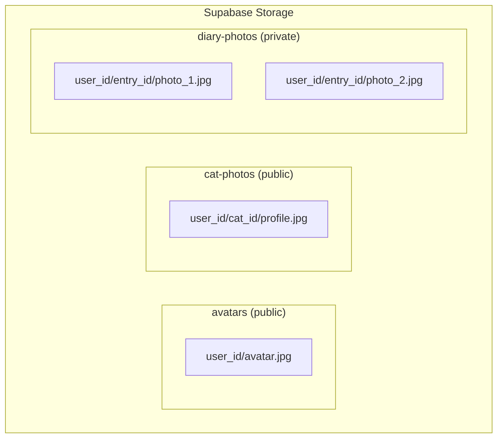

### 5.2 ストレージポリシー

```sql
-- バケット作成
insert into storage.buckets (id, name, public) values 
    ('avatars', 'avatars', true),
    ('cat-photos', 'cat-photos', true),
    ('diary-photos', 'diary-photos', false);

-- アバター: 自分のみアップロード可、全員閲覧可
create policy "Avatar upload" on storage.objects for insert
    with check (bucket_id = 'avatars' and auth.uid()::text = (storage.foldername(name))[1]);

create policy "Avatar public read" on storage.objects for select
    using (bucket_id = 'avatars');

-- 猫写真: 自分のみCRUD可、全員閲覧可
create policy "Cat photo CRUD" on storage.objects for all
    using (bucket_id = 'cat-photos' and auth.uid()::text = (storage.foldername(name))[1]);

-- 日記写真: 自分のみCRUD可
create policy "Diary photo CRUD" on storage.objects for all
    using (bucket_id = 'diary-photos' and auth.uid()::text = (storage.foldername(name))[1]);
```

### 5.3 画像最適化パイプライン

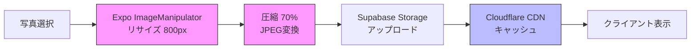

---

## 6. コスト分析

### 6.1 Supabase料金体系

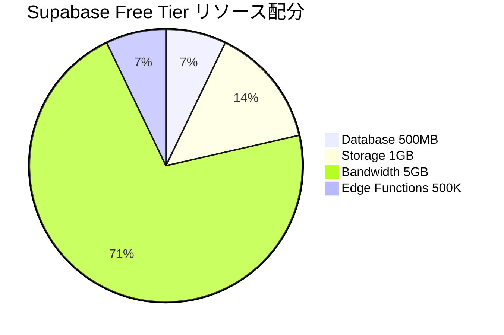

### 6.2 ユーザー規模別コスト

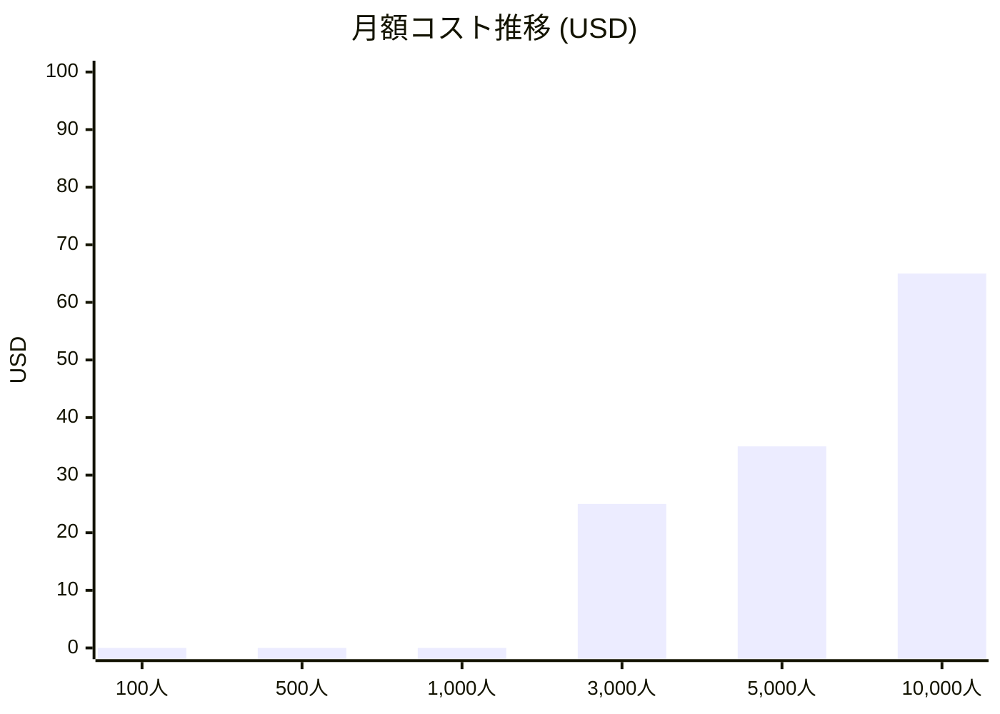

### 6.3 詳細コスト表

| ユーザー数 | DB使用量 | Storage | 帯域 | Supabase | その他 | 月額合計 |
|------------|----------|---------|------|----------|--------|----------|
| 100人 | 5MB | 100MB | 500MB | $0 | $1 (ドメイン) | **$1** |
| 500人 | 25MB | 500MB | 2.5GB | $0 | $1 | **$1** |
| 1,000人 | 50MB | 1GB | 5GB | $0 | $1 | **$1** |
| 3,000人 | 150MB | 3GB | 15GB | $25 | $1 | **$26** |
| 5,000人 | 250MB | 5GB | 25GB | $25 + $10 | $1 | **$36** |
| 10,000人 | 500MB | 10GB | 50GB | $25 + $40 | $1 | **$66** |

### 6.4 無料枠最大化戦略

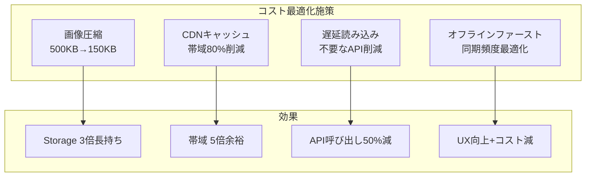

---

## 7. セキュリティ設計

### 7.1 セキュリティレイヤー

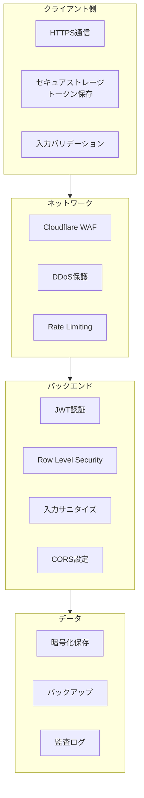

### 7.2 認証フロー詳細

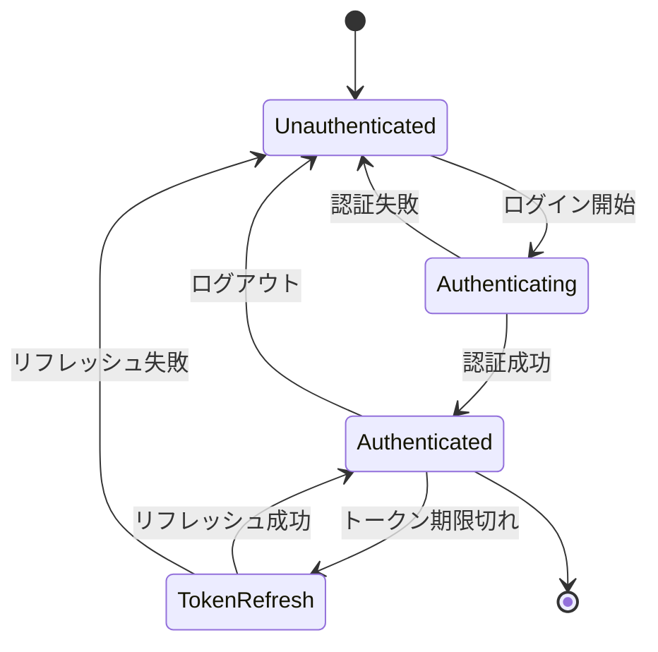

---

## 8. 通知システム

### 8.1 通知フロー

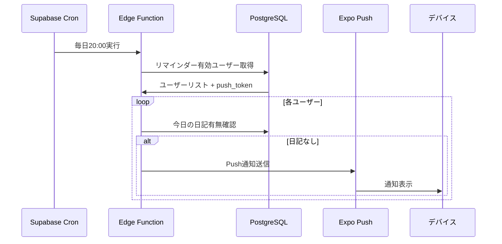

### 8.2 通知種別

| 種別 | トリガー | 内容 |
|------|----------|------|
| 日記リマインダー | 毎日指定時刻 | 「今日の猫日記を書きましょう」 |
| 予定通知 | 予定日時の1日前/1時間前 | 「明日は〇〇の予定があります」 |
| 健康記録 | 体重未記録7日経過 | 「〇〇ちゃんの体重を記録しましょう」 |

---

## 9. デプロイメント

### 9.1 CI/CDパイプライン

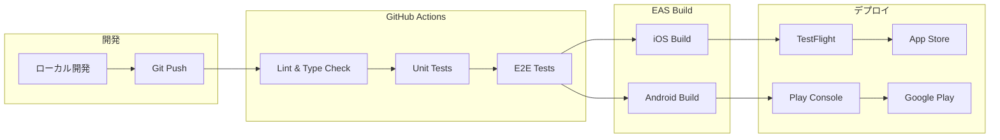

### 9.2 環境構成

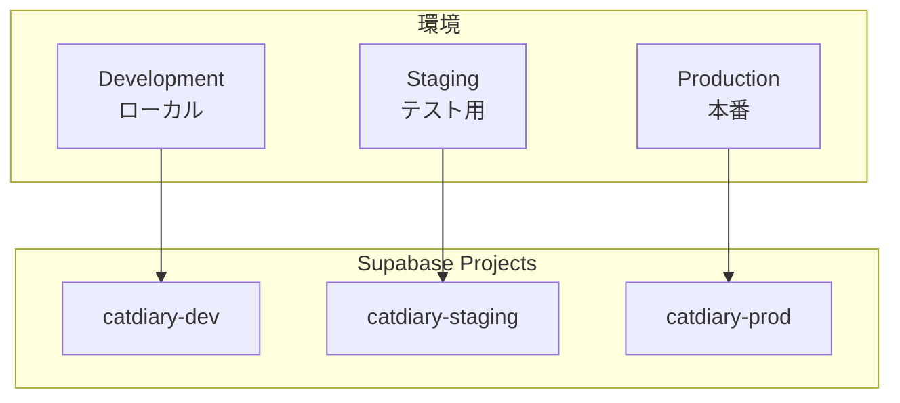

---

## 10. 監視・運用

### 10.1 監視項目

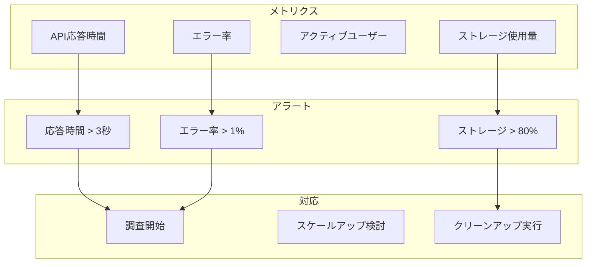

### 10.2 ダッシュボード

- **Supabase Dashboard**: DB/Storage/Auth メトリクス
- **Cloudflare Analytics**: CDNヒット率、帯域
- **Expo Dashboard**: Push通知配信率
- **Sentry**: エラー追跡（無料枠あり）

---

## 11. マイルストーン

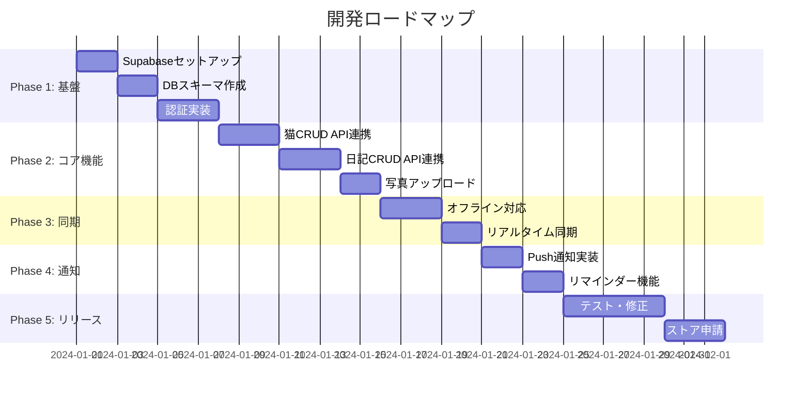

---

## 12. 参考リンク

- [Supabase Documentation](https://supabase.com/docs)
- [Expo Documentation](https://docs.expo.dev)
- [React Navigation](https://reactnavigation.org/docs/getting-started)
- [Cloudflare Workers](https://developers.cloudflare.com/workers/)

---

## 付録: 環境変数

```bash
# .env.local (開発用)
EXPO_PUBLIC_SUPABASE_URL=https://xxxxx.supabase.co
EXPO_PUBLIC_SUPABASE_ANON_KEY=eyJxxxxx

# EAS Secrets (本番用)
# eas secret:create --name SUPABASE_URL --value "https://xxxxx.supabase.co"
# eas secret:create --name SUPABASE_ANON_KEY --value "eyJxxxxx"
```
